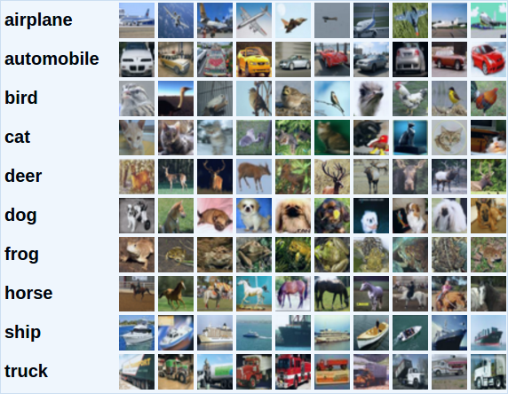

## Project 2 (Image Classification)
In this project, you'll classify images from the CIFAR-10 dataset. The dataset consists of airplanes, dogs, cats, and other objects. The dataset will need to be preprocessed, then train a convolutional neural network on all the samples. You'll normalize the images, one-hot encode the labels, build a convolutional layer, max pool layer, and fully connected layer. At then end, you'll see their predictions on the sample images.



## Installation
First install [Conda](https://conda.io/docs/user-guide/install/index.html), then create/activate a virtualenv from the provided environment file like this:

```
conda env create -f environment.yml
source activate dlnd 
```

Finally, open the solution notebook:
```
jupyter notebook dlnd_image_classification.ipynb 
```

## (Optional) Running the Udacity Deep Learning Foundations image classification project on floydhub.com

You are not required to use FloydHub for this project, but we've provided instructions if you'd like help getting set up.

1. Create an account on [floydhub.com](https://www.floydhub.com) (don't forget to confirm your email). Create an individual account on floydhub.com (don't forget to confirm your email). (You won’t be able to finish most projects in the one hour allowed for free trials). Prices for floydhub.com are currently $0.432 / hour of GPU use, and most of your projects will run in around 2 - 3 hours. In order to minimize cost, you may want to try to both debug as much as possible on your local computer and make sure that you end your jobs soon after they finish.

2. Install the `floyd` command on your computer:

        pip install -U floyd-cli
        
    Do this even if you already installed `floyd-cli` before, just to make sure you have the most recent version (Its pace of development is fast!).

3. Associate the command with your Floyd account:

        floyd login

    (a page with authentication token will open; you will need to copy the token into your terminal)


4. Enter the folder for the image classification project:

        cd image-classification

5. Initiate a Floyd project:

        floyd init dlnd_image_classification

6. Run the project:

        floyd run --data mat_udacity/datasets/udacity-cifar-10/1:cifar --mode jupyter --gpu --env tensorflow-1.2

    It will be run on a machine with GPU (`--gpu`), using a Tenserflow environment (`--env tensorflow-1.2`), as a Jupyter notebook (`--mode jupyter`), with the cifar-10 dataset available (`--data mat_udacity/datasets/udacity-cifar-10/1:cifar`).
    
7. Wait for the Jupyter notebook to become available and then access the URL displayed in the terminal (described as "path to jupyter notebook"). You will see the notebook.

8. Remember to explicitly stop the experiment when you are not using the notebook. As long as it runs (even in the background) it will cost GPU hours. You can stop an experiment in the ["Experiments" section on floyd.com](https://www.floydhub.com/experiments) or using the `floyd stop` command:

        floyd stop ID
 
    (where ID is the "RUN ID" displayed in the terminal when you run the project; if you lost it you can also find it in the ["Experiments" section on floyd.com](https://www.floydhub.com/experiments))
    
**Important:** When you run a project it will always start from scratch (i.e. from the state present *locally* on your computer). If you made changes in the remote jupiter notebook during a previous run, the changes will **not** be present in subsequent runs. To make them permanent you need to add the changes to your local project folder. When running the notebook you can download them directly from Jupyter - *File / Download / Notebook*. After downloading it, just replace your local `dlnd_image_classification.ipynb` file with the newly downloaded one.

Alternatively, If you already stoped the experiment, you can still download the file using the `floyd output` command:

    floyd output ID

(where ID is the "RUN ID" displayed in the terminal when you run the project; if you lost it you can also find it in the ["Experiments" section on floyd.com](https://www.floydhub.com/experiments))
    
Just run the command above, download `dlnd_image_classification.ipynb` and replace your local version with the newly downloaded one.
